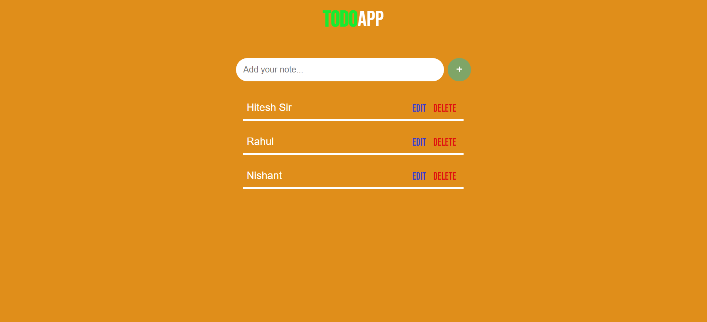
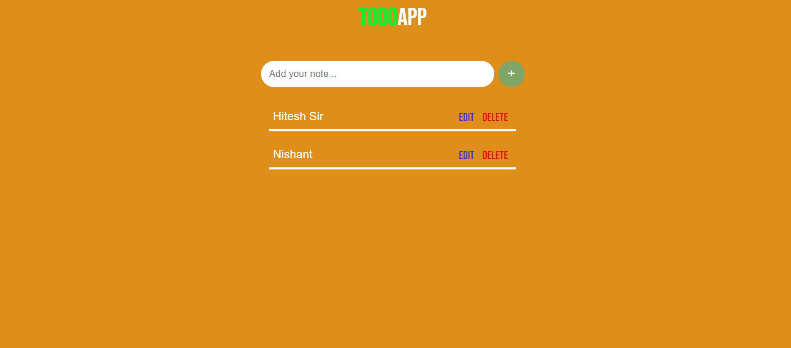
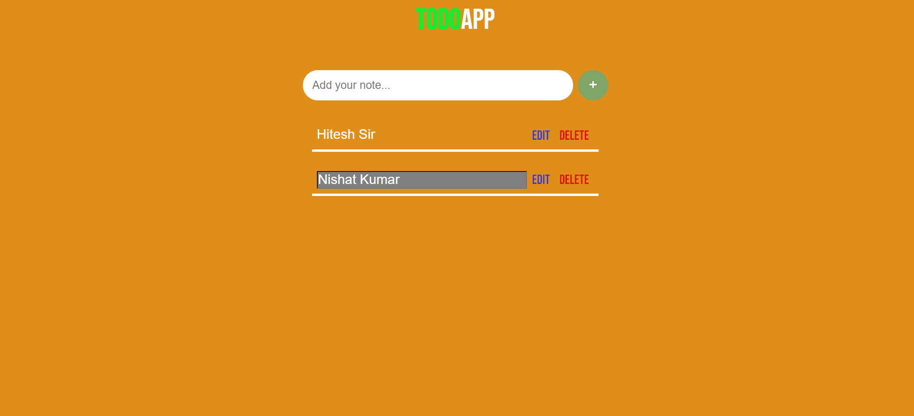

## What to build

we have to build TODO List.

## Techanology used

we have used HTML, CSS and JavaScript DOM

## What I have learned from this project

I have learned how to Design ToDo List, and how to perform add data in list and edit added data.

## Output

### TODO Added Item

### TODO Removed Item

### TODO Edited Item

### Instructor

**Hitesh choudhary**
